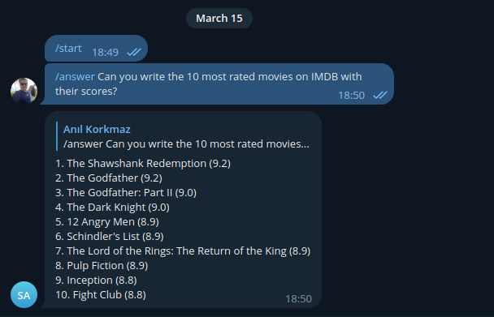

# Readme

Thanks to this bot, you can directly connect with open-ai via telegram, ask questions and get answers.

# Using
1. Check the telegram docs to learn how to create a bot and get a bot key. https://core.telegram.org/bots/features#botfather
1. if you are not a member create openai membership and get an api key https://platform.openai.com/account/api-keys

# Setting environment variables


```
TELEGRAM_TOKEN=<YOUR_TOKEN>
OPENAI_TOKEN=<YOUR_APO_KEY>
ELIGIBLE_TELEGRAM_USER_IDS=1380418313,12321232
ELIGIBLE_TELEGRAM_GROUP_IDS=-100189853,636732
```
1. Set Telegram and openai token information

2. This bot has some restrictions to use only by the people you want.  so make sure it's only used on the groups and users you want.Separate the ids with commas.
For example

```
TELEGRAM_TOKEN=<YOUR_TOKEN>
OPENAI_TOKEN=<YOUR_APO_KEY>
ELIGIBLE_TELEGRAM_USER_IDS=1380418313,12321232
ELIGIBLE_TELEGRAM_GROUP_IDS=-10018985
```
3. You can find your Telegram username with @userinfobot

# How to use?

You can run the project locally or deploy it to any server. I used heroku so the procfile is attached.

You can ask the bot your questions directly with /answer.


